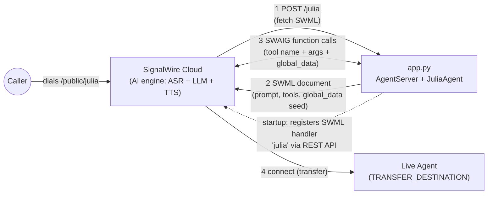
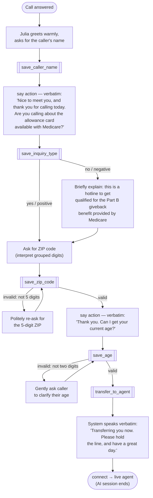
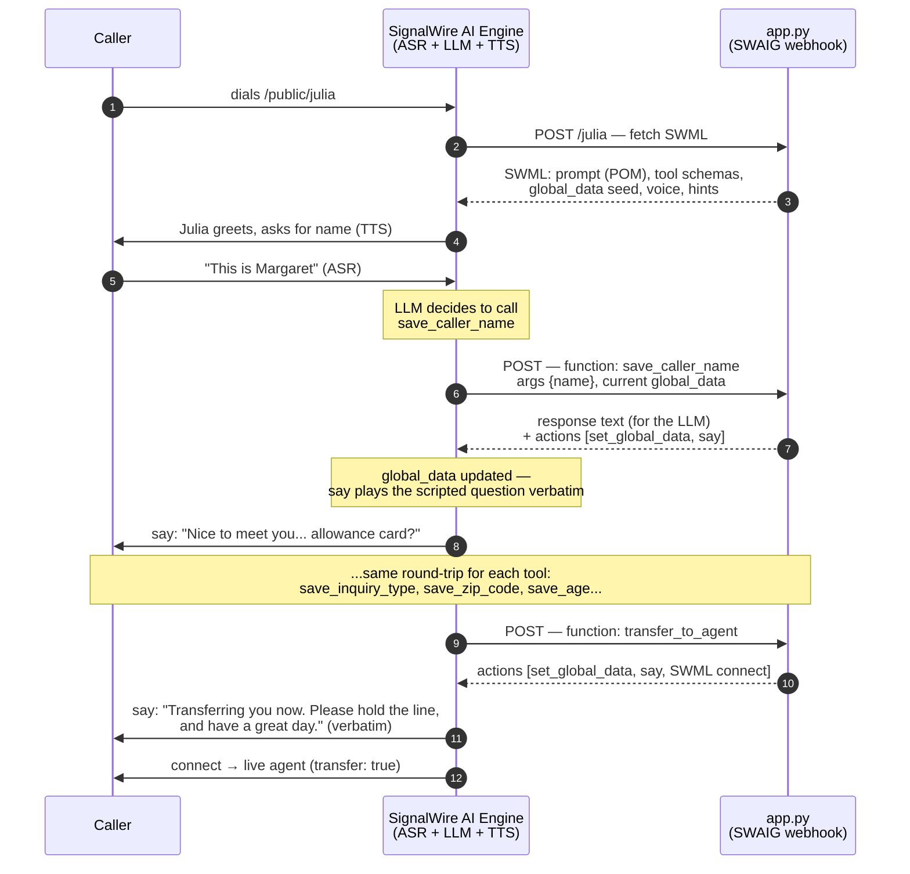
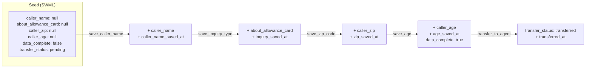
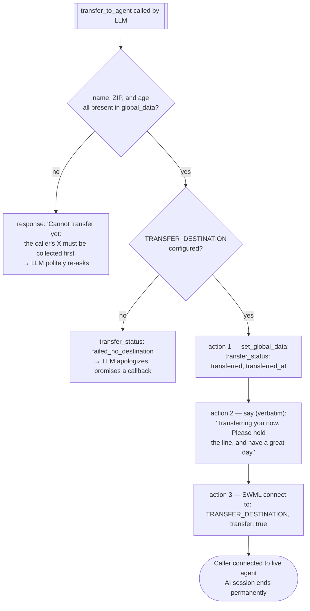

# Julia — Medicare Allowance Card Eligibility Agent

Julia is a SignalWire AI voice agent that answers calls from senior citizens asking about the Medicare allowance card, collects their eligibility details (name, ZIP code, age), saves everything to `global_data`, and then transfers the caller to a live agent — speaking a mandated goodbye line verbatim before the transfer.

Built on **[`signalwire-sdk`](https://pypi.org/project/signalwire-sdk/) ≥ 3.0.2** (import name `signalwire`), following the patterns in `signalwire-demos/example` (app structure, handler registration, `global_data`) and `signalwire-demos/personal-assistant` (call transfer via `connect`).

---

## Table of Contents

- [Architecture](#architecture)
- [The Call Flow](#the-call-flow)
- [SWAIG: How the Tools Work](#swaig-how-the-tools-work)
- [The Tools](#the-tools)
- [global_data: The Call's Memory](#global_data-the-calls-memory)
- [The Transfer](#the-transfer)
- [Project Layout](#project-layout)
- [Setup & Running](#setup--running)
- [Testing with swaig-test](#testing-with-swaig-test)
- [HTTP Endpoints](#http-endpoints)
- [Design Decisions](#design-decisions)

---

## Architecture

The app is a single FastAPI service (via the SDK's `AgentServer`) that plays two roles: it **serves the SWML document** that tells SignalWire how to run the AI conversation, and it **hosts the SWAIG webhook** that SignalWire calls back into every time the AI invokes a tool.



On startup, the app registers (or updates) an **External SWML Handler** named `julia` in your SignalWire space via the REST API, which makes the agent dialable at the Fabric address `/public/julia`. No dashboard clicking required — deploy the app and the handler points at it.

Key point: **the LLM runs inside SignalWire's cloud, not in this app.** This app only defines the prompt, validates and stores data, and decides when/where to transfer. That separation is what makes the data handling deterministic even though the conversation is driven by an LLM.

---

## The Call Flow

The conversation follows a strict, ordered script (from `prompt.txt`). Every piece of information the caller provides is immediately persisted to `global_data` through a tool call.



Conversation rules baked into the prompt:

- **Never repeat the caller's name back** — accuracy doesn't matter and correcting it wastes the caller's time.
- **ZIP interpretation** — callers often speak ZIPs in groups ("two-thirty, forty-seven" → `23047`); dashes or extra digits get a polite "we only need your 5-digit zipcode."
- **Don't over-verify** — answers are only confirmed if they seem incomplete or unclear.
- **Garbled input** — ask the caller to repeat; if it keeps happening, ask them to move somewhere quieter.
- If asked about the benefit itself, Julia explains we only need age and ZIP, and the live agent can answer everything else.

The prompt deliberately contains **only things the LLM can act on** — word choice, question order, tool calls. Everything else lives in the right layer instead: vocal tone comes from the TTS voice, spoken-digit normalization ("oh" → 0) happens in speech recognition before the LLM sees text, and every verbatim scripted line (the allowance-card question, the age question, the goodbye) is a `say` action attached to a tool result, so the model never has to reproduce a sentence exactly.

The **mandatory final order** is enforced twice — once in the prompt, and once in code (the `transfer_to_agent` guard): collect ZIP and age, *then* transfer.

---

## SWAIG: How the Tools Work

**SWAIG** (SignalWire AI Gateway) is how a SignalWire AI agent calls functions. SWAIG functions are not a separate concept from "LLM tools" — they **are** the tools. The SDK renders each one into a standard tool schema (name + description + JSON Schema parameters) that is sent to the LLM on every turn, exactly like native OpenAI/Anthropic tool calling. When the model decides to call one, SignalWire makes an HTTP request to this app, and the app's response steers both the conversation and the platform.



A SWAIG response has two parts, and the distinction matters:

| Part | Who consumes it | What it's for |
|---|---|---|
| **`response`** (text) | The **LLM** | Instructions/data for the model's next turn — e.g. `"Zip code stored. The system is asking the caller for their age. Wait for their answer, then call save_age."` The caller never hears this directly. |
| **`action`** (list) | The **platform** | Deterministic operations executed in order: `set_global_data` (persist state), `say` (speak exact text), `SWML` (run verbs like `connect`), etc. |

This split is the core design lever: anything that must happen *exactly* (persisting data, speaking a mandated phrase, transferring the call) goes in **actions**; anything conversational (what to ask next, how to phrase a re-ask) goes in the **response** for the LLM to act on.

In the SDK, tools are defined with the `@self.tool()` decorator and results are built with `SwaigFunctionResult`:

```python
@self.tool(
    name="save_zip_code",
    description="Store the caller's 5-digit zip code...",  # prompt engineering — tells the LLM WHEN to call it
    parameters={"type": "object", "properties": {"zip_code": {"type": "string", ...}}, "required": ["zip_code"]}
)
def save_zip_code(args, raw_data):
    digits = re.sub(r"\D", "", str(args.get("zip_code") or ""))
    if len(digits) != 5:
        return SwaigFunctionResult("Invalid zip code... ask the caller to repeat...")  # LLM re-asks

    global_data = raw_data.get("global_data", {}) or {}
    global_data["caller_zip"] = digits

    result = SwaigFunctionResult("Zip code stored. The system is asking for the caller's age...")
    result.update_global_data(global_data)              # ← action: persist to global_data
    result.say("Thank you. Can I get your current age?")  # ← action: scripted question, verbatim
    return result
```

---

## The Tools

Five SWAIG functions. Every one that accepts data validates it server-side and persists it to `global_data` with a timestamp.

| Tool | Parameters | Validation (server-side) | Writes to global_data |
|---|---|---|---|
| `save_caller_name` | `name` (string, required) | none — stored as heard, never corrected | `caller_name`, `caller_name_saved_at` |
| `save_inquiry_type` | `about_allowance_card` (boolean, required) | — | `about_allowance_card`, `inquiry_saved_at` |
| `save_zip_code` | `zip_code` (string, required) | strips non-digits; must be **exactly 5 digits** or returns a re-ask instruction | `caller_zip`, `zip_saved_at`, `data_complete` |
| `save_age` | `age` (integer, required) | must be a **two-digit number (10–99)** or returns a clarify instruction | `caller_age`, `age_saved_at`, `data_complete` |
| `transfer_to_agent` | *(none)* | guard: `caller_name`, `caller_zip`, `caller_age` must all be saved; `TRANSFER_DESTINATION` must be configured | `transfer_status`, `transferred_at`, `data_complete` |

Validation failures don't crash the flow — the tool returns a `response` telling the LLM exactly what to do ("Politely ask the caller to repeat their 5 digit zipcode, then call this tool again"), which produces the retry loops in the flow chart above.

Three tools also attach a **`say` action** so the scripted lines from the spec play verbatim: `save_caller_name` asks the allowance-card question, `save_zip_code` asks for the age, and `transfer_to_agent` speaks the goodbye. The tool's `response` tells the LLM the question has already been asked, so it just waits for the answer.

Every tool also declares **fillers** — short phrases like "Let me write that down…" that the platform speaks *while the webhook executes*, so the caller never hears dead air during a tool call. Fillers are per-language (`{"en-US": [...]}`) and picked at random per invocation, which keeps repeated saves from sounding robotic.

---

## global_data: The Call's Memory

`global_data` is SignalWire's per-call key/value store. It survives across every SWAIG call within the conversation, is visible to the LLM, and rides along in every webhook — making it the single source of truth for what has been collected so far.

**Lifecycle:**

1. **Seeded** in the SWML document (`self.set_global_data({...})` in `_setup_prompts`) so every field has a known home from second zero.
2. **Updated** by each tool via `result.update_global_data(...)` — the platform merges the new keys into the call's state.
3. **Read back** by later tools via `raw_data["global_data"]` — this is how `transfer_to_agent` verifies all details were actually collected, regardless of what the LLM *thinks* happened.



**Full schema:**

| Key | Type | Set by | Meaning |
|---|---|---|---|
| `agent` | string | seed | Always `"julia"` — identifies the agent in downstream systems |
| `caller_name` | string | `save_caller_name` | Name as heard; never verified or repeated back |
| `caller_name_saved_at` | ISO 8601 UTC | `save_caller_name` | When the name was stored |
| `about_allowance_card` | boolean | `save_inquiry_type` | Whether the caller was asking about the allowance card |
| `inquiry_saved_at` | ISO 8601 UTC | `save_inquiry_type` | When the inquiry type was stored |
| `caller_zip` | string (5 digits) | `save_zip_code` | Validated ZIP code |
| `zip_saved_at` | ISO 8601 UTC | `save_zip_code` | When the ZIP was stored |
| `caller_age` | integer (10–99) | `save_age` | Validated two-digit age |
| `age_saved_at` | ISO 8601 UTC | `save_age` | When the age was stored |
| `data_complete` | boolean | zip/age/transfer tools | `true` once both ZIP and age are saved |
| `transfer_status` | string | seed / `transfer_to_agent` | `pending` → `transferred`, or `failed_no_destination` |
| `transferred_at` | ISO 8601 UTC | `transfer_to_agent` | When the transfer was initiated |

If `POST_PROMPT_URL` is set, a post-prompt runs after the call ends and posts a JSON summary (name, allowance-card intent, ZIP, age, transfer outcome) to that URL — useful for CRM ingestion or call logging.

---

## The Transfer

The transfer is the most safety-critical moment of the call, so nothing about it is left to the LLM. The mandated goodbye line is spoken by a **`say` action** — SWAIG actions execute strictly in order, so the sequence is deterministic:



Why this shape:

- **`say`, not a prompt instruction.** You cannot force an LLM to emit an exact sentence, exactly once. The `say` action plays the required phrase verbatim, every call, and the prompt explicitly tells the model *not* to speak its own goodbye so it never duplicates it.
- **Guard in code, not in prompt.** The prompt already orders the steps, but the handler independently re-checks `global_data` — if the LLM tries to transfer early, it gets a refusal naming exactly which fields are missing.
- **`connect(..., final=True)`** makes it a *permanent* transfer: SWML replaces the agent and the call continues with the live agent. (`final=False` would instead return the caller to Julia if the far end hung up — not wanted here.)
- **Data is saved before the call leaves.** `set_global_data` is the first action, so the record is complete even though the AI session is about to end.
- **Graceful degradation.** With no `TRANSFER_DESTINATION` configured, the caller gets an apology and a callback promise instead of dead air, and `transfer_status` records the failure.

---

## Project Layout

```
agent/
├── app.py            # Everything: agent definition, SWAIG tools, server, handler registration
├── prompt.txt        # The original prompt spec this agent implements
├── requirements.txt  # signalwire-sdk, gunicorn, uvicorn, python-dotenv
├── Procfile          # Production entrypoint (gunicorn + uvicorn worker)
├── .env.example      # Documented environment configuration — copy to .env
└── .venv/            # Local virtualenv (gitignored)
```

`app.py` sections, top to bottom:

1. **SWML handler registration** — finds-or-creates the External SWML Handler `julia` via the REST API at startup, pointing it at this app's public URL (with basic-auth credentials embedded).
2. **`JuliaAgent(AgentBase)`** — `_setup_prompts()` builds the POM prompt sections (Identity, Style, Response Guidelines, Task and Goals, Error Handling, Mandatory Final Order), configures the voice (`elevenlabs.rachel`), speech hints, and the `global_data` seed; `_setup_functions()` registers the five tools.
3. **`create_server()`** — `AgentServer` with the agent mounted at `/julia` plus `/health`, `/ready`, and `/get_token` endpoints.

---

## Setup & Running

### 1. Configure

```bash
cp .env.example .env
```

| Variable | Required | Purpose |
|---|---|---|
| `SIGNALWIRE_SPACE_NAME` | ✅ | Your space (e.g. `myspace` or `myspace.signalwire.com`) |
| `SIGNALWIRE_PROJECT_ID` | ✅ | Project ID from the dashboard |
| `SIGNALWIRE_TOKEN` | ✅ | API token |
| `TRANSFER_DESTINATION` | ✅ (for transfers) | Live-agent phone number (`+15551234567`) or SIP address |
| `TRANSFER_CALLER_ID` | – | Caller-ID override for the transfer leg |
| `SWML_PROXY_URL_BASE` | local dev | Public URL SignalWire can reach (e.g. ngrok); on Dokku/Heroku `APP_URL` is auto-set |
| `SWML_BASIC_AUTH_USER` / `SWML_BASIC_AUTH_PASSWORD` | recommended | Fixed basic-auth for the SWML endpoint; without them the SDK generates random per-process credentials and the registered URL won't authenticate |
| `AGENT_NAME` | – | Fabric resource name (default `julia`); the dialable address becomes `/public/{AGENT_NAME}`. Use e.g. `julia-dev` locally so you don't repoint production |
| `PORT` | – | HTTP port (default `5000`) |
| `POST_PROMPT_URL` | – | Webhook that receives the JSON call summary after each call |

### 2. Run locally

```bash
python3 -m venv .venv
source .venv/bin/activate
pip install -r requirements.txt

# expose the app so SignalWire can fetch SWML from it
ngrok http 5000                 # then set SWML_PROXY_URL_BASE in .env

python app.py
```

On startup the app registers the SWML handler and logs the dialable address (`/public/julia`). Call it from the SignalWire dashboard, a SIP client, or any phone number you point at the handler.

### 3. Deploy (Dokku / Heroku style)

The `Procfile` runs `gunicorn app:app` with a uvicorn worker. `APP_URL` is auto-detected, so no URL configuration is needed — just set the credentials, `TRANSFER_DESTINATION`, and basic-auth vars.

---

## Testing with swaig-test

The SDK ships a CLI that exercises the agent **without placing a call** — it renders the SWML and invokes tool handlers with simulated post data.

```bash
source .venv/bin/activate

# What tools does the agent expose?
swaig-test app.py --list-tools

# Full SWML document (prompt, tool schemas, global_data seed)
swaig-test app.py --dump-swml --raw | python3 -m json.tool

# Exercise individual tools
swaig-test app.py --exec save_caller_name --name "Margaret"
swaig-test app.py --exec save_zip_code --zip_code "23047"     # → stored
swaig-test app.py --exec save_zip_code --zip_code "2304"      # → re-ask instruction
swaig-test app.py --exec save_age --age 67                    # → stored
swaig-test app.py --exec save_age --age 7                     # → clarify instruction

# Transfer guard: missing data → refusal naming the gaps
swaig-test app.py --fake-full-data \
  --custom-data '{"global_data":{"caller_age":67}}' \
  --exec transfer_to_agent

# Full transfer: all data present + destination configured
TRANSFER_DESTINATION="+15551234567" swaig-test app.py --fake-full-data \
  --custom-data '{"global_data":{"caller_name":"Margaret","about_allowance_card":true,"caller_zip":"23047","caller_age":67}}' \
  --exec transfer_to_agent
```

The last command should emit three actions in order — the complete transfer contract:

```json
{ "set_global_data": { "...": "...", "transfer_status": "transferred", "data_complete": true } }
{ "say": "Transferring you now. Please hold the line, and have a great day." }
{ "SWML": { "sections": { "main": [ { "connect": { "to": "+15551234567" } } ] }, "version": "1.0.0" }, "transfer": "true" }
```

> Note: `--custom-data` must appear **before** `--exec` — everything after `--exec <tool>` is parsed as tool arguments.

---

## HTTP Endpoints

| Endpoint | Method | Purpose |
|---|---|---|
| `/julia` | POST | SWML document + SWAIG webhook (basic-auth protected) |
| `/health` | GET | Liveness check for deploy platforms |
| `/ready` | GET | Readiness — reports the dialable address once the SWML handler is registered |
| `/get_token` | GET | Mints a 24-hour guest token scoped to this agent's address, for WebRTC test clients |
| `/get_resource_info` | — | *(not exposed here; see the example demo)* |

---

## Design Decisions

1. **Every datum lands in `global_data` immediately.** Each answer is persisted by a tool call the moment it's heard — with a timestamp — so even a call that drops mid-flow leaves a usable partial record, and the post-prompt summary has ground truth to draw from.
2. **Validate in code, steer with prose.** The LLM interprets messy speech ("two-thirty, forty-seven"), but the handlers are the gatekeepers: 5-digit ZIP and two-digit age are enforced server-side, and bad input turns into a precise re-ask instruction rather than bad data.
3. **Exact phrases are `say` actions, never prompt hopes.** Every sentence the spec requires verbatim — the allowance-card question, the age question, the goodbye — is played by the platform, not generated by the model. The prompt only contains what the LLM can actually control: word choice, question order, and tool calls. Vocal warmth is the TTS voice's job; spoken-digit normalization happens in ASR before the LLM sees text.
4. **The transfer is guarded twice.** Prompt ordering *and* a code-level check of `global_data` — the mandatory final order (ZIP + age, then transfer) holds even if the model misbehaves.
5. **One file, no database.** The call state lives in SignalWire's `global_data`; the app itself is stateless, so it scales horizontally and restarts safely mid-call.
